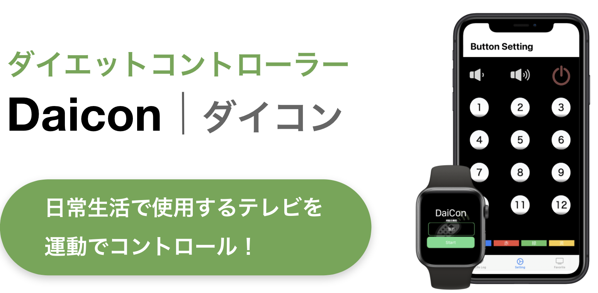
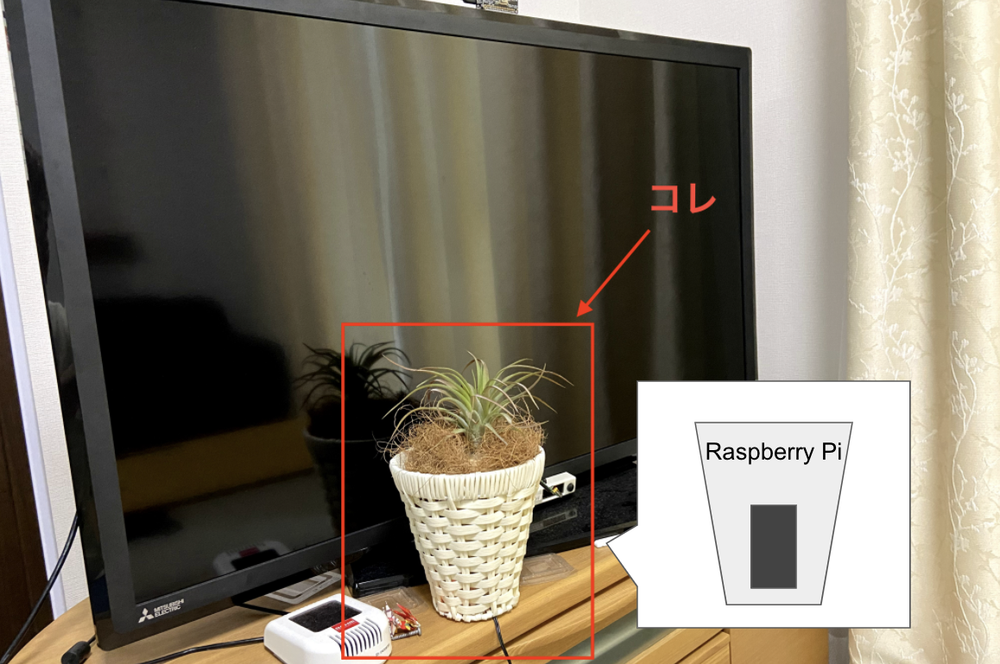
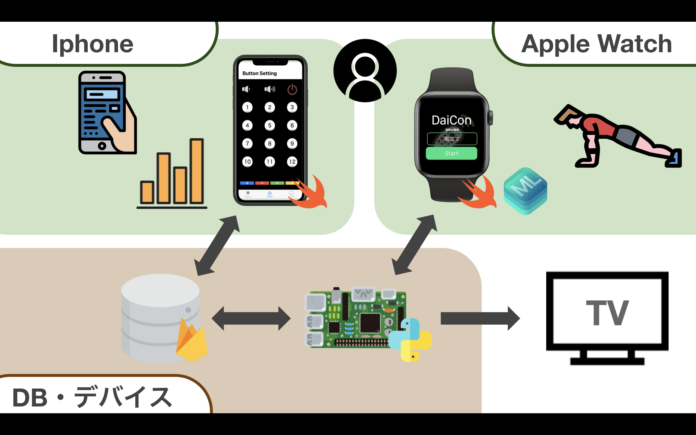
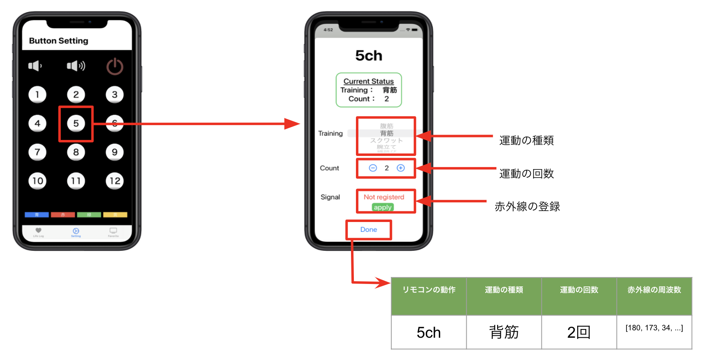
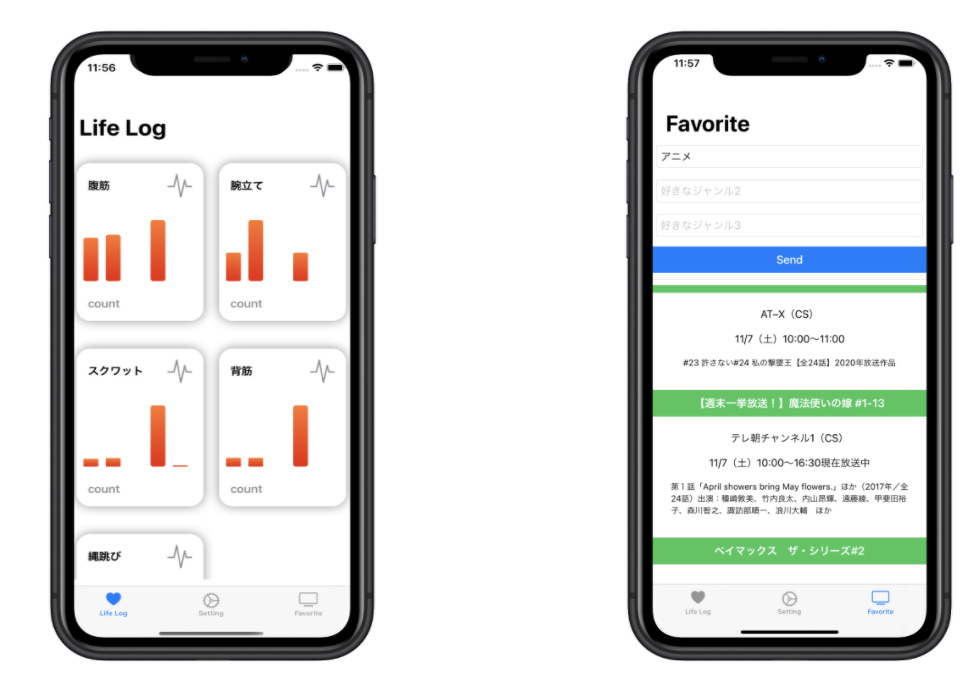
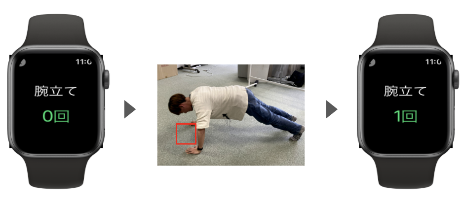
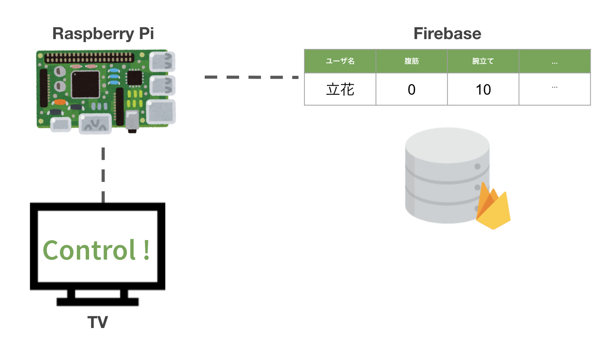

# DaiCon

## 製品概要
### 背景(製品開発のきっかけ、課題等）
最近はコロナのせいで、在宅ワークやリモート授業などで家にいる時間が多くなっています。
そのせいで体を動かす機会が少なくなり、実はコロナ以前に比べ 57%の人が体重増加しているという問題にもつながっています。
この状況を危惧してダイエットを始めなきゃいけない！と感じる人は多いと思いますが、ジムに行くのも感染リスクがあるため入りづらいですよね。
とはいえ、家でダイエットを始めようと思っても続けることって、とてっっっも難しいですよね(僕も3日坊主で終わっちゃいます笑)。
そんなあなたに提供するのが、 ___日常生活で利用するTVを運動でコントロールすることで、家での継続的なダイエットをユーザに支援できる___ システムです。
名付けて！ダイエットコントローラー、略して「DaiCon」です。

1. でもこんな大根オブジェクト...どうやって家電を制御するの?
1. どうやって運動を認識するの?
1. 仮に運動を認識できたとしても、どうせ続かない...

安心してください！
あなたの不安、全部解消します！

### 製品説明（具体的な製品の説明）
システムはRaspberry Pi, Apple watch, iphone の3つのデバイスで構成されています。

### iphone[Setting画面]
始めにユーザは、iphoneのSetting画面から、リモコンの動作・運動の種類・運動の回数を赤外線の周波数と紐付けます。
TrainingとCountを設定してSettingボタンを押すと、Raspberry Piに接続された受信モジュールが起動し、DaiConに送信することができます。
Doneを押すと、リモコンの動作・運動の種類と・運動の回数・赤外線の周波数を1レコードとしてFirebaseに登録できます。

### iphone[Life Log画面・Favorite画面]
Firebaseで登録された情報をもとに、ユーザは自分の運動の結果を見ることができます。運動は直近5日の記録を確認できます。棒グラフをタップすると、運動した日付とその回数を把握することができます。その時間に放送されているユーザの好みに合わせた番組を推薦することができます。ユーザはテキストボックスに文字を入力すると、Webスクレイピングを行い、テキストボックスに入力された情報に関連する番組の「番組名・放送局・放送日時・詳細」の情報を取得します。これにより、ユーザに対してその番組を見るためのモチベーションを与えることができます。なお、Firebaseにユーザの好みの情報は登録されています。

### Apple watch
Apple watchに内蔵されている加速度・角速度センサーしてユーザの動作データを収集します。
収集したデータをCoreMLというAppleが提供するフレームワークを利用してDeep Learning(LSTM)に入力し、動作を推定します。
これにより、リアルタイムでユーザの動作を認識することができます！
また、運動中はAIが「頑張ってください」や「お疲れ様でした」などの、応援をしてくれます。
一定時間以上動作がなければ、「運動の種類・運動の回数」をRaspberry Piに送信します。

### Raspberry Pi
Apple watchから「運動の種類・運動の回数」を受け取ると、iphoneのSettingで入力した情報をもとに、赤外線の情報をTVに送信します。
また、Firebaseにユーザの運動結果を反映します。

#### 特長1
Raspberry Piに接続された赤外線でモジュールでTVの赤外線を登録し、
TVに発信することであらゆるTVの動作を制御することができます！
また、赤外線で稼働するデバイスに対しても制御できるため、汎用性もあります！

#### 特長2
Apple watchに内蔵されている加速度・角速度センサーしてユーザの動作データを収集します。
収集したデータをCoreMLというAppleが提供するフレームワークを利用してDeep Learning(LSTM)に入力し、動作を推定します。
これにより、リアルタイムでユーザの動作を認識することができます！

#### 特長3
私たちのシステムでは、ユーザが継続的にダイエットを行うための、3つの工夫を用意しています。
1. 運動前
ユーザの趣向に合わせたテレビ番組をシステムが推薦します。
これにより、ユーザに対してその番組を見るためのモチベーションを与えることができます。
1. 運動中
運動中はAIが「頑張ってください」や「お疲れ様でした」などの、応援をしてくれることでユーザのモチベーションを維持します。
1. 運動後
自分の運動の成果がログとして残り、グラフに反映されるのでユーザに達成感を与えます。

### 解決出来ること
DaiConにより、ユーザは家で継続的にダイエットできないという問題を解決することができます。

### 今後の展望
今後はTVだけでなく、エアコンなどの他の家電にも対応したシステム設計にしていければと思います。

### 注力したこと（こだわり等）
* システムUI
* モデル構築(各動作のデータを集めるのがとてもキツかった...)
* iphone[Setting]画面のリモコンを再現するのを工夫

## 開発技術
### 活用した技術

#### フレームワーク・ライブラリ・モジュール
* Swift
    * SwiftUI
    * CoreML
    * [Alamofire](https://github.com/Alamofire/Alamofire)
    * [QGrid](https://github.com/Q-Mobile/QGrid)
    * [ChartView](https://github.com/AppPear/ChartView)
* Python
    * Flask
    * BeautifulSoup4

#### デバイス
* iPhone
* Apple Watch
* Raspberry Pi
    * 赤外線送受信モジュール

#### その他
* Firebase
    * Cloud Firestore

### 独自技術
#### ハッカソンで開発した独自機能・技術
* ユーザの好みに合わせた番組推薦アルゴリズム
